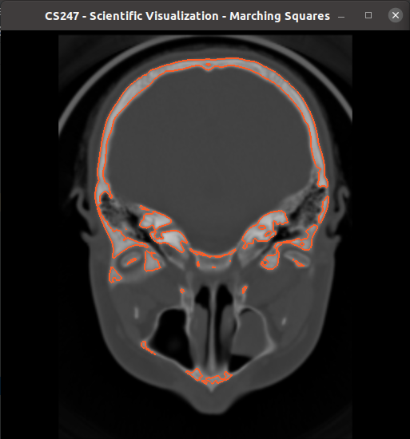

# Assignment 2 Description (5% of total grade) #
**Due: February 27th**

Based on Assignment #1 the task in this assignment is to create a 2D iso contour renderer on top of the slice views.

## Reading assignments ##

* Data Visualization book, Chapter 5 until 5.3 (inclusive)

## Basic Tasks ##

* Draw iso-contour corresponding to selected iso-value. Use the Marching Squares algorithm to extract iso-contours for a given slice. Next, draw the calculated contours on top of that slice. The iso-contour is computed on the CPU (marching squares) and rendered using OpenGL

## Minimum Requirements ##
### 2D Iso-contours Rendering [100 points] ###
+ Draw Iso-contours on the given slice and corresponding to the selected iso-value (40 points)
    * For Iso-contours, use epsilon to overcome degeneracies (10 points)
    * When drawing iso-contours, make sure you calculate the exact location by interpolation (20 points)
    * Make sure when you change the slice everything gets updated correctly (10 points)
+ The iso value must be editable by the user, updating the views (20 points)

## Bonus ##
* For the 2D view, show all three axis-aligned slices and draw their contours (+4 points)

## Notes ##

* Remember to upload some documentation file, with a short description of the methods you implemented and include some images or a video of your results. You can also describe your main learnings or problems during implementation. 
* There aren't prototypes for every function you might need. Create functions as you need them.

## Screenshots for Minimum Requirements Solution ##

